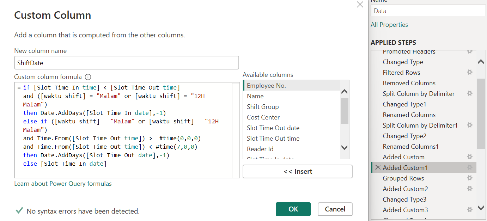
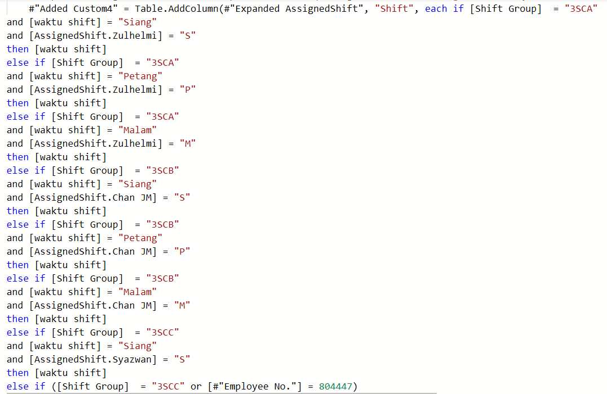
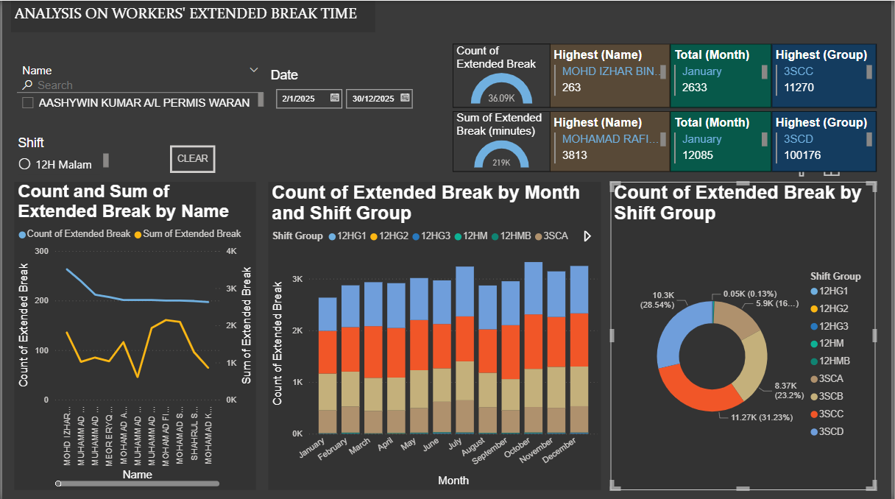

# ANALYSIS ON WORKERS' EXTENDED BREAK TIME

## Project description
An analysis to track on workers who frequently took break longer than their limit everyday. The dataset contains information like name, employee id number, employees’ shift group and the time when they start and finish their break. This analysis 
is conducted by using Power BI. The data is filtered to only consists of workers’ break from year 2025.

Source of data:
https://docs.google.com/spreadsheets/d/1W9bDORFJ70nOWJ-x1jQ5gsewPKcTWuys/edit?usp=drive_link&ouid=107190325714836561299&rtpof=true&sd=true

Dataset preview  

## Research question
- How to find the correct shift date considering that overtime workers might take a break past midnight?
- How to find total break time for workers if they take break more than one everyday?
- How to compare the workers' shift time in the data with their assigned shift schedule to find the overtime workers?
- How to calculate the workers' excess break time?

## Tools Used
- Power BI

## Features
- Splitting the timedate columns to get the date and time for going out and going in from break. The groups have different start and end shift time. The "waktu shift" column was made to categorize different shift time based on the in and out break time columns.

 "Waktu shift" column 

 - By using the shift time, shift date column was made to accurately calculate the date of workers' shift while taking consideration on different date that was caused by taking a break past midnight.

Shift date column 

- Group the workers by using group by on id, name, group, shift time and date to get the sum of interval between the on the in and out break time columns. Create limit break column to get the time limit on workers' break based on their group

  Total interval column 
  
  Limit break column 

- Create a new query on the workers' shift schedule and merge both queries. Compare the shift between waktu shift column and shift time from schedule to find the workers that did overtime.

  Shift column 
  

- Subtracting the value from total interval with the time limit to get every workers that extended their break.

 ## Dashboard

https://github.com/user-attachments/assets/0293c9b8-3ed1-43cc-9f02-f2bbf18b12a4

